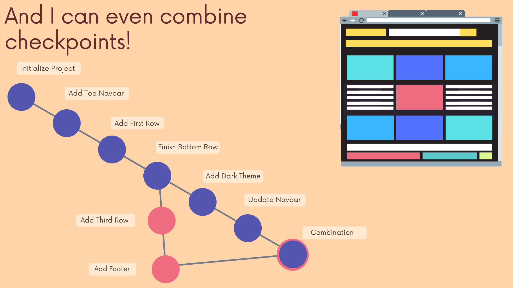
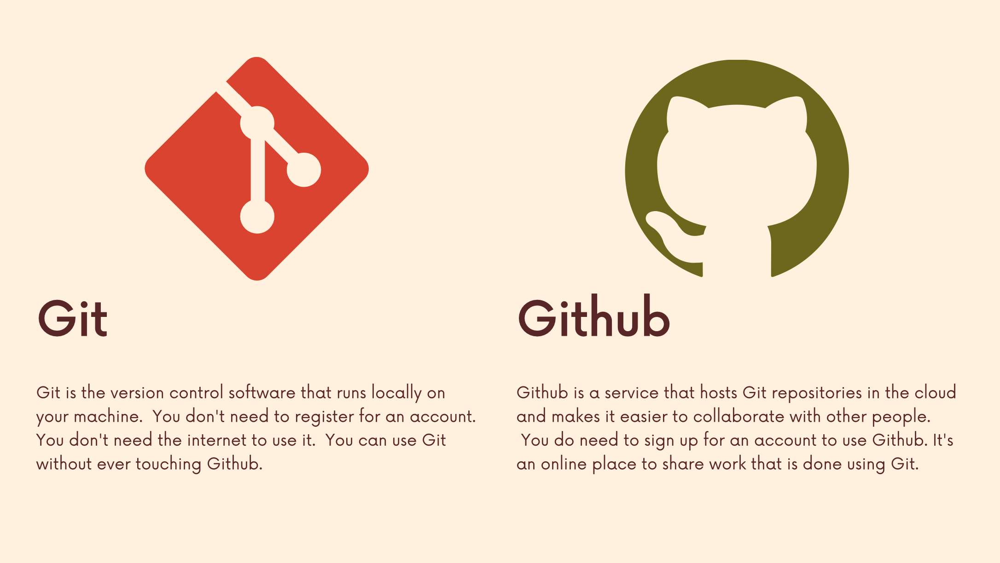

# The Git & Github Bootcamp

## Section 2. Introducint Git!

### 2.6 What Really Matters In This Section
[Section Slide](doc/S2_Git+&+Github_+Intro+To+Git.pdf)

### 2.7 What Exactly Is Git?
**Git** is the world's most popular version control system. [Git Link](https://git-scm.com/)

**Version Control** is software that tracks and manages changes to files over time. Version ccontrol systems generally allow users to revisit earlier versions of the files, compare changes between versions, undo changes, and a whole lot more. 

**Git is just one VSC.** Other: Subversion, Team Foundation Version Control .... We only need to know Git, as 95% of developer use Git.

### 2.8 Visualizing Git
Visualize the basic idea of Git.

### 2.9 Quick History of Git
**Linus Torvalds** is the creator and main developer behind Linux and Git.

**Git** development was started by Torvalds in April 2005 when the proprietary source-control management (SCM) system used for Linux kernel development since 2002, **BitKeeper**, revoked its free license for Linux development.

### 2.10 Who Uses Git?
**WHO:** Engineers & Coders, Tech-Adjacent Roles, Governments, Writers, and Scientists.

### 2.11 Git VS Github: What's the Difference?

