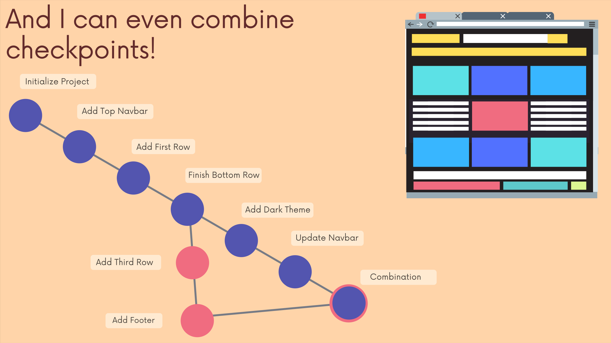

# The Git & Github Bootcamp

## Section 3. Installation & Setup

### 3.12 What Really Matters in This Section
**Critical:** Installing Git, Configuring Git Name & Email, Terminal Operation.
**Importatn:** Installing GitKraken 
[Section Slide](doc/S3_Git+&+Github_+Installation.pdf)

### 3.13 Installing Git: Terminal VS GUIs
**Git** is primarily a terminal tool.
**Git GUI:** Github Desktop, SourceTree, GitKraken ......

### 3.14 WINDOWS Git Installation
We can use `git --version` to check whether Git install successfully or not.

### 3.15 MAC Git Installation
Most Mac is pre-intstalled the Git. Also, use the command `git --version` to check Git version.
### 3.16 Configuring Your Git Name & Email

### 3.17 Installing GitKraken (Our GUI)

### 3.18 Terminal Crash Course: Introduction

### 3.19 Terminal Crash Course: Navigation

### 3.20 Terminal Crash Course: Creating Files & Folders

### 3.21 Terminal Crash Course: Deleting Files & Folders

Visualize the basic idea of Git.

### 2.9 Quick History of Git
**Linus Torvalds** is the creator and main developer behind Linux and Git.

**Git** development was started by Torvalds in April 2005 when the proprietary source-control management (SCM) system used for Linux kernel development since 2002, **BitKeeper**, revoked its free license for Linux development.

### 2.10 Who Uses Git?
**WHO:** Engineers & Coders, Tech-Adjacent Roles, Governments, Writers, and Scientists.

### 2.11 Git VS Github: What's the Difference?

