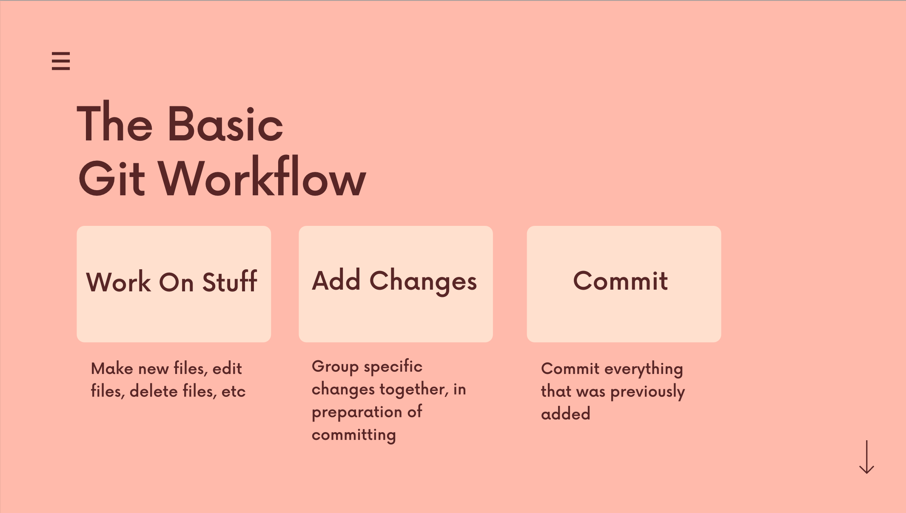
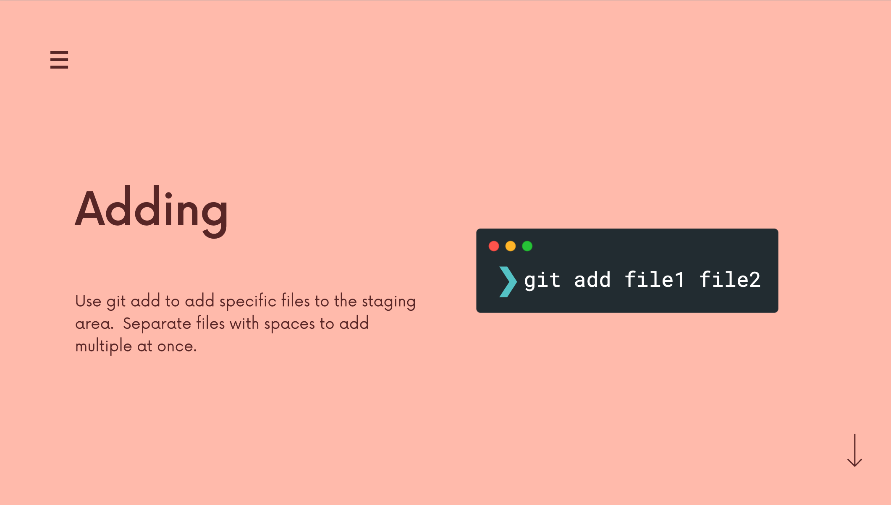
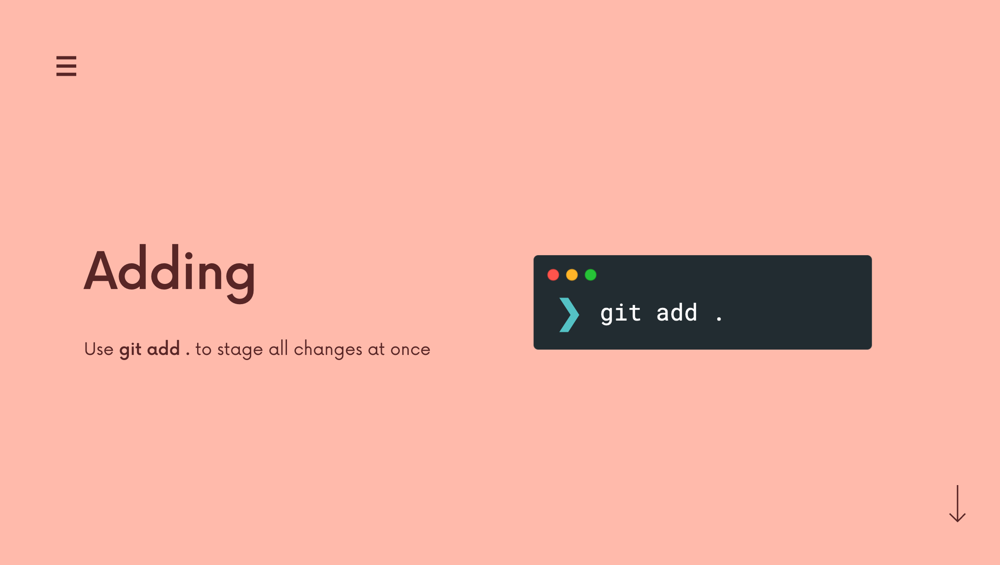
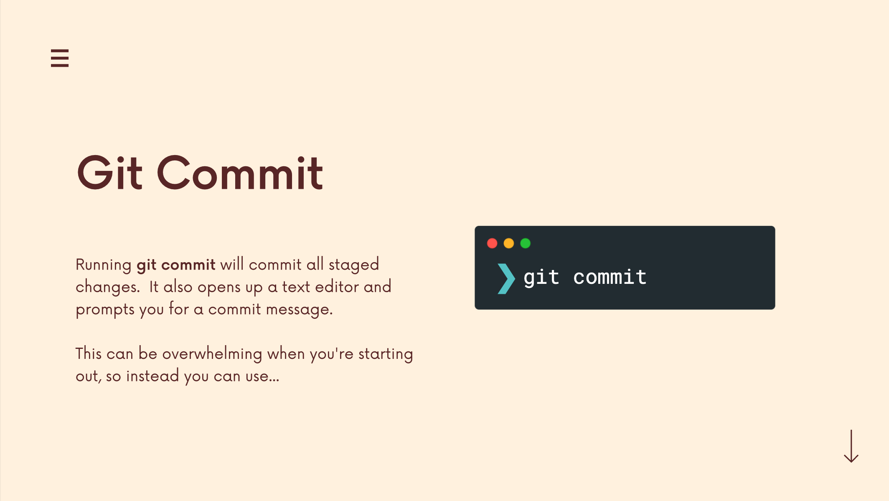

# The Git & Github Bootcamp

## Section 4. The Very Basics Of Git: Adding & Committing
---
### 4.22 What Really Matters In This Section
**Critical:** What Are Git Repos? Git Init; Git Status; The Committing Workfolw; Git Add; Git Commit; Git Log.
**Importatn:** Understanding the .git folder. 
[Section Slide: S4_Git+&+Github_+Basics.pdf](doc/S4_Git+&+Github_+Basics.pdf)

----

### 4.23 What Is Git Repo?

Every Git Repo has its own history.

----

### 4.24 Our First Commands: Git Init and Git Status


----

### 4.25 The Mysterious .Git Folder
We can use `ls -a` to check whether there is a `.git` folder. 
We also can use the `rm -rf .git` to remove the `.git` folder.

----

### 4.26 A Common Early Git Mistake
Git tracks a directory and all nested subdirectories!
**DO NOT INIT A REPO INSIDE OF A REPO! Before running `git init`, using `git status` to verify that you are not currently inside of a repo!**


----

### 4.27 The Committing Workflow Overview

Git commit is not just only saving one file. Commit is to group all the modifications of files and folders together and save in one commit.



----

### 4.28 Staging Changes With Git Add




----

### 4.29 Finally, The Git Commit Command!




----

### 4.30 The Git Log Command (And More Committing)
We can use the `git log` to check the history commit.

----

### 4.31 Committing Exercise
[Excercise](https://plum-poppy-0ea.notion.site/Committing-Basics-Exercise-3dc1ef1873ce45e68cedd2265710d7d8)
```
 1817  mkdir GitBootcampExercise
 1818  ls
 1819  cd GitBootcampExercise
 1820  mkdir S4_Shopping
 1821  ls
 1822  cd S4_Shopping
 1823  touch yard.txt
 1824  l,s
 1825  ls
 1826  touch groceries.txt
 1827  git status
 1828  git init
 1829  git status
 1830  git add groceries.txt yard.txt
 1831  git status
 1832  git commit  -m "create yard and groceries lists"
 1833  git status
 1834  git add groceries.txt
 1835  git status
 1836  git commit -m "add ingredients for tomato soup"
 1837  git add yard.txt
 1838  git status
 1839  git commit -m "add items needed for garden box"
 1840  git add .
 1841  git status
 1842  git commit -m "add items needed to grow potatoes"
 1843  git log
```


