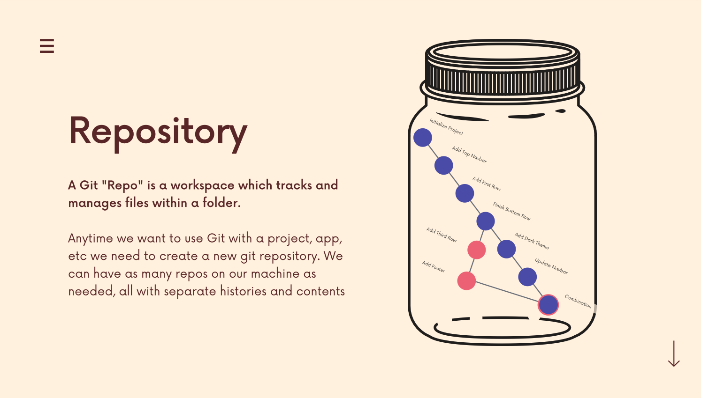
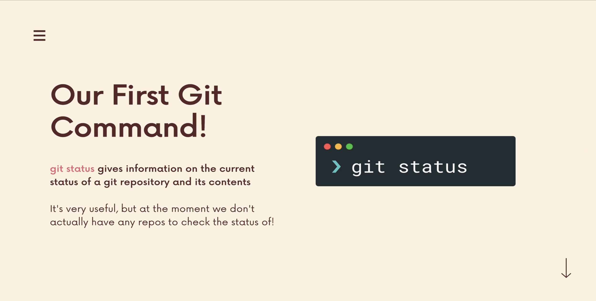

# The Git & Github Bootcamp

## Section 4. The Very Basics Of Git: Adding & Committing

### 4.22 What Really Matters In This Section
**Critical:** What Are Git Repos? Git Init; Git Status; The Committing Workfolw; Git Add; Git Commit; Git Log.
**Importatn:** Understanding the .git folder. 
[Section Slide: S4_Git+&+Github_+Basics.pdf](doc/S4_Git+&+Github_+Basics.pdf)

### 4.23 What Is Git Repo?

Every Git Repo has its own history.

### 4.24 Our First Commands: Git Init and Git Status



---------
---------


### 3.13 Installing Git: Terminal VS GUIs
**Git** is primarily a terminal tool.
**Git GUI:** Github Desktop, SourceTree, GitKraken ......

### 3.14 WINDOWS Git Installation
We can use `git --version` to check whether Git install successfully or not.


### 3.15 MAC Git Installation
Most Mac is pre-intstalled the Git. Also, use the command `git --version` to check Git version.
If install the new version, please remember to close the current terminal and reopen it and use `git --version` to check again.

### 3.16 Configuring Your Git Name & Email
Configuring Git: 
```
git config --global user.name "Runzhe Zhang"    # To set Git user name
git config user.name                            # To check Git user name

git config --global user.email buecezrz@bu.edu  # To set Git user email
git config user.email                           # To check Git user email
```
### 3.17 Installing GitKraken (Our GUI)
Download the [GitKraken](https://www.gitkraken.com).

### 3.18 Terminal Crash Course: Introduction
Basic terminal command line, such like `ls, cd, touch`.

### 3.19 Terminal Crash Course: Navigation
Basic navigation command lines,
```
ls          # list all the documents
open .      # open current directory in Mac
start .     # open current directory in Windows
pwd         # print the current path
cd          # change directory
cd ..       # back to the parent folder
```

### 3.20 Terminal Crash Course: Creating Files & Folders
Basic creating files & folders command:
```
touch file_name1 file_name2         # To create a new file or modify a existing file
touch red.txt green.txt

clear                               # clear terminal command line

mkdir folder_name                   # To create a new directory/folder
```

### 3.21 Terminal Crash Course: Deleting Files & Folders
Basic deleting files & folders command:
```
rm file_name                    # To delete file
rm -rf folder_name              # To recursive delete the folder and all including files
```


