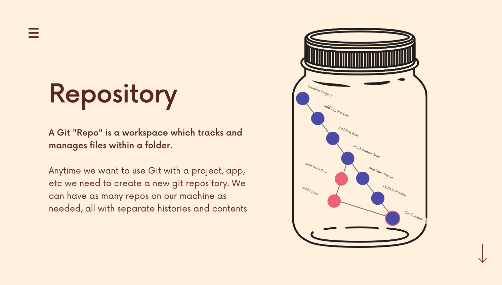
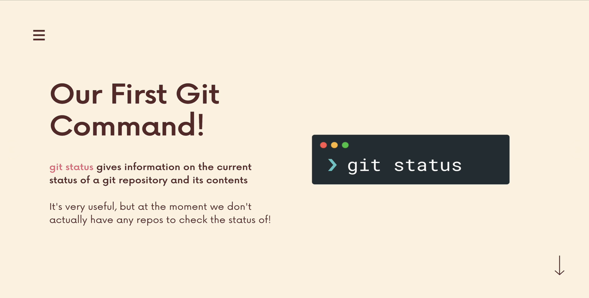
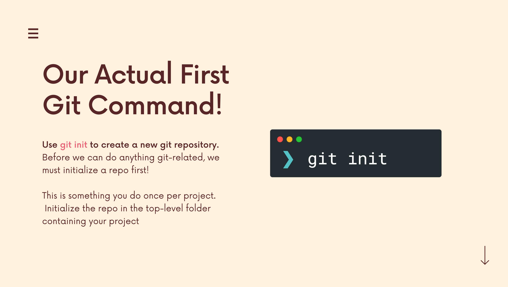
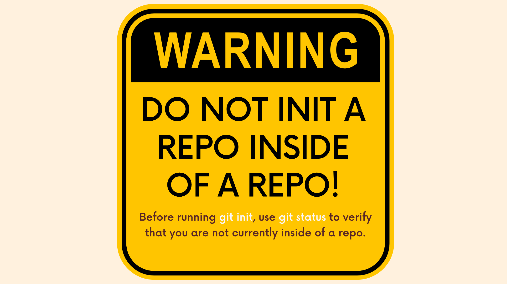
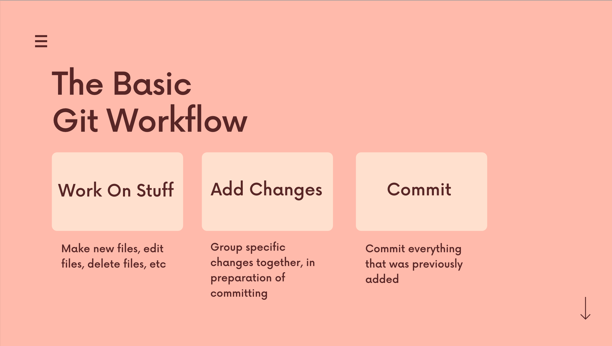
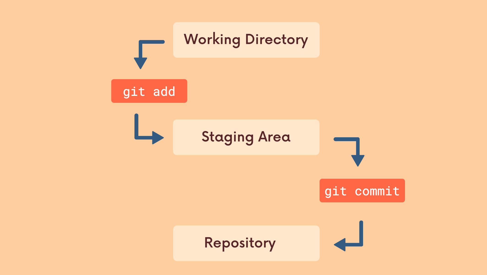
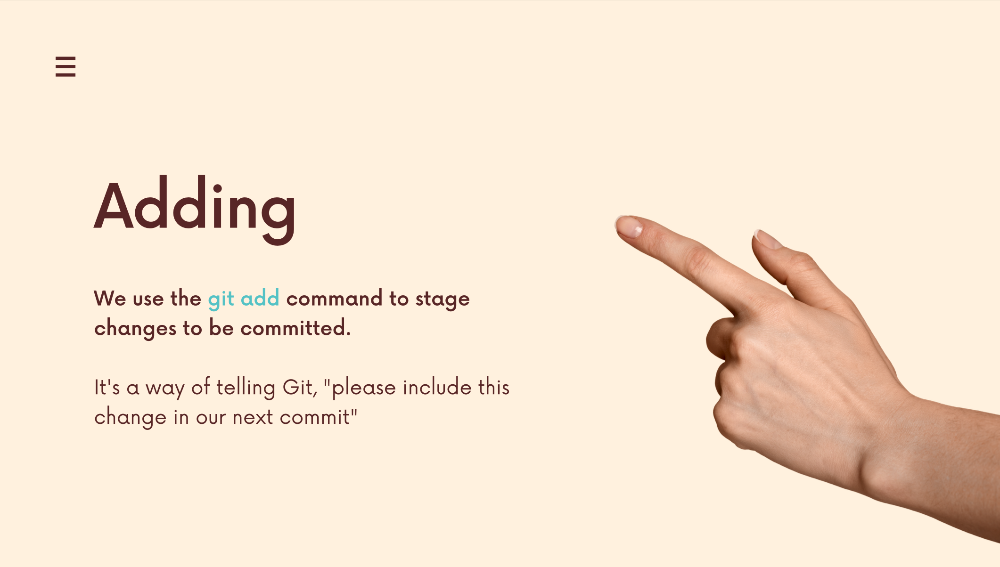
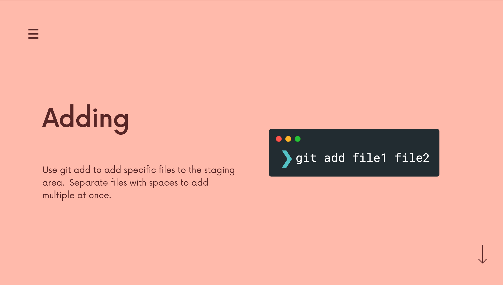
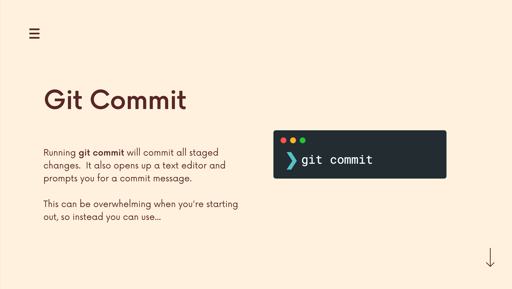

# The Git & Github Bootcamp

## Section 5. Commits In Detail
---
### 4.22 What Really Matters In This Section
**Critical:** What Are Git Repos? Git Init; Git Status; The Committing Workfolw; Git Add; Git Commit; Git Log.
**Importatn:** Understanding the .git folder. 
[Section Slide: S4_Git+&+Github_+Basics.pdf](doc/S4_Git+&+Github_+Basics.pdf)

----

### 4.23 What Is Git Repo?

Every Git Repo has its own history.

----

### 4.24 Our First Commands: Git Init and Git Status

----

### 4.25 The Mysterious .Git Folder
We can use `ls -a` to check whether there is a `.git` folder. 
We also can use the `rm -rf .git` to remove the `.git` folder.

----

### 4.26 A Common Early Git Mistake
Git tracks a directory and all nested subdirectories!
**DO NOT INIT A REPO INSIDE OF A REPO! Before running `git init`, using `git status` to verify that you are not currently inside of a repo!**

----

### 4.27 The Committing Workflow Overview

Git commit is not just only saving one file. Commit is to group all the modifications of files and folders together and save in one commit.

----

### 4.28 Staging Changes With Git Add

----

### 4.29 Finally, The Git Commit Command!

----

### 4.30 The Git Log Command (And More Committing)

----

### 4.31 Committing Exercis

