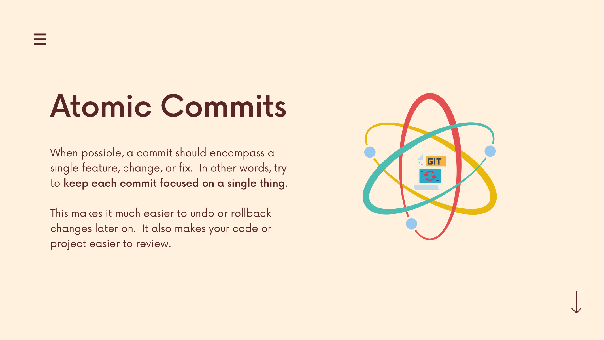
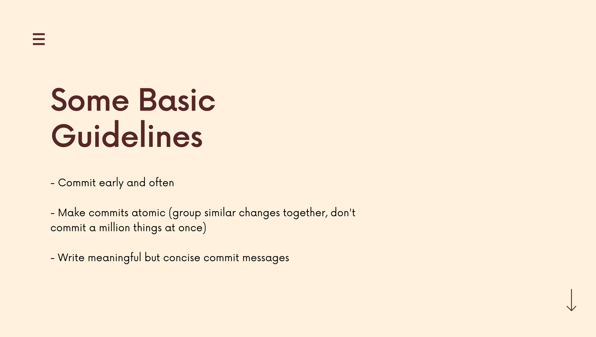
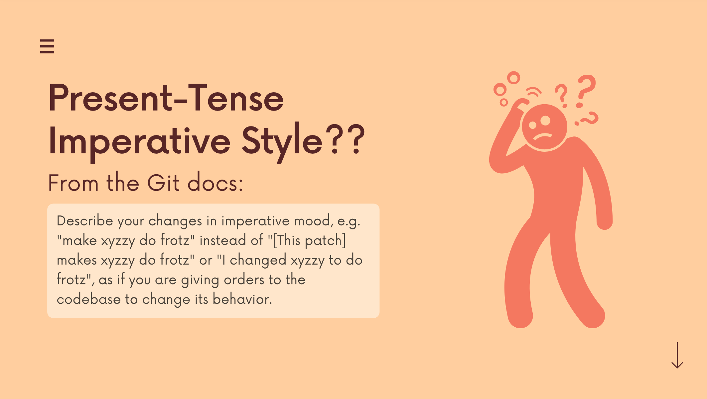
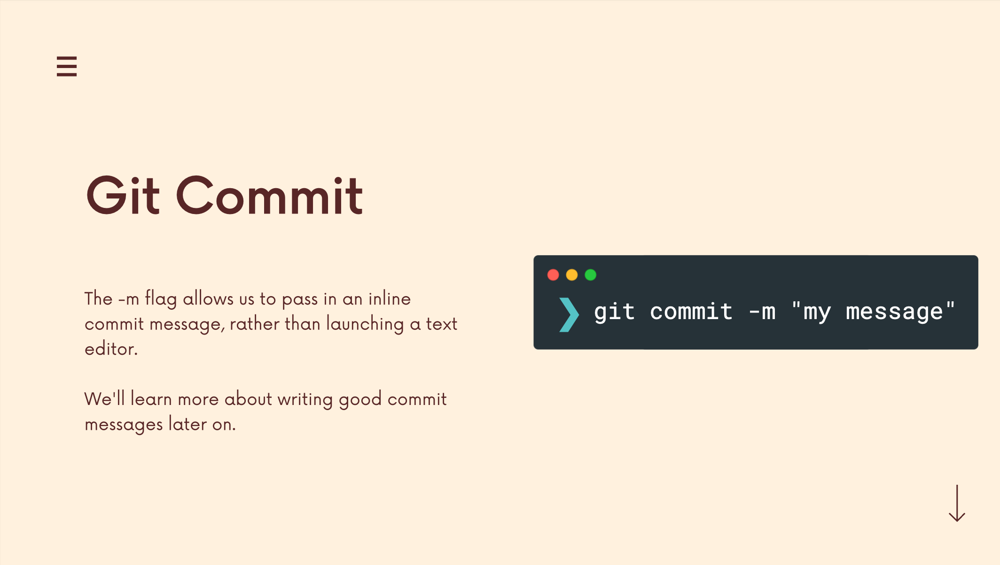
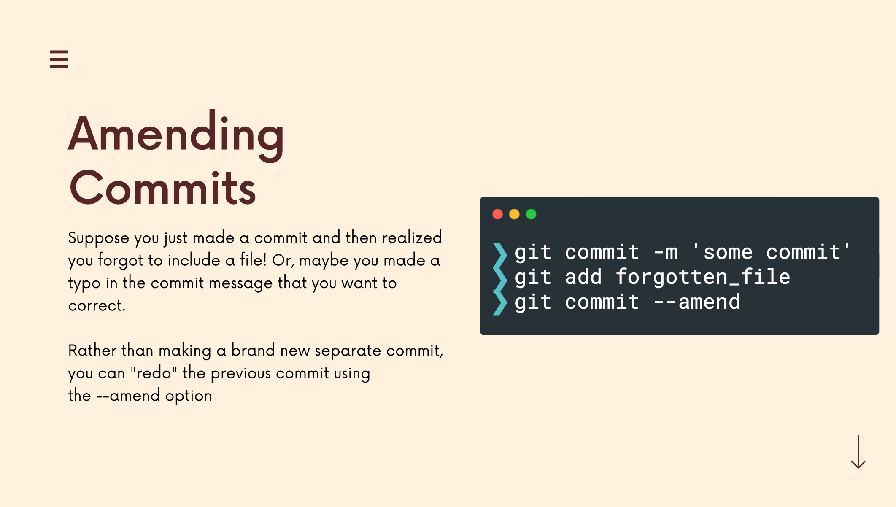

# The Git & Github Bootcamp

## Section 5. Commits In Detail
---
### 5.32 What Really Matters In This Section
**Critical:** Git Ignore,
**Importatn:** Writing Atomic Commits, Configuring Default Editor (Mac), Writing Good Commit Messages, Navigating the Git Documentation
**Nice To Have** Working With a GUI, Amending Commits

[Section Slide: S5_Git+&+Github_+Committing+In+Detail.pdf](doc/S5_Git+&+Github_+Committing+In+Detail.pdf)

----

### 5.33 Navigating The Git Documentation
[Git Reference](https://git-scm.com/docs)

----

### 5.34 Keeping Your Commits Atomic

----

### 5.35 Commit Messages: Present Or Past Tense?
[Past or Present Tense 1](https://stackoverflow.com/questions/3580013/should-i-use-past-or-present-tense-in-git-commit-messages)
[Past or Present Tense 2](https://www.quora.com/Which-tense-should-be-used-in-a-git-commit-message-past-present-and-why)
[Past or Present Tense 3](https://www.danclarke.com/git-tense)
[Past or Present Tense 4](https://medium.com/@corrodedlotus/which-tense-should-be-used-on-a-git-commit-message-121cb641134b)

----

### 5.36 Escaping VIM & Configuring Git's Default Editor
[Git Commands - Setup and Config](https://git-scm.com/book/en/v2/Appendix-C%3A-Git-Commands-Setup-and-Config)

Change the default editor from `VIM` to `VScode` using command:
`git config --global core.editor "code --wait"`

If can't find the VScode, open the VScode manually and press `Command + Shift + P`. Then type `code` and click `Shell Command: Install 'code' command in Path`.

----

### 5.37 A Closer Look At The Git Log Command
[git log](https://git-scm.com/docs/git-log)
We can use the `git log` to check the Git history.
If the commit message is too long and messy, we can use the 
**`git log --oneline`**
`--oneline` is a shorthand for `--pretty=oneline --abbrev-commmit`

----

### 5.38 Committing With A GUI
[GitKraken](https://www.gitkraken.com/)

----

### 5.39 Fixing Mistakes With Amend
[Git Commit](https://git-scm.com/docs/git-commit)

`git commit --amend` only can modify the last commit.

----

### 5.40 Ignoring Files with .gitignore

[Git .ignoring Introduction](https://docs.github.com/en/get-started/getting-started-with-git/ignoring-files?platform=mac)
[Git .ignoring doc](https://git-scm.com/docs/gitignore)
[Git .ignoring Tool](https://www.toptal.com/developers/gitignore)

Samples: 
[Signal-Android](https://github.com/signalapp/Signal-Android)
[tensorflow](https://github.com/tensorflow/tensorflow)

