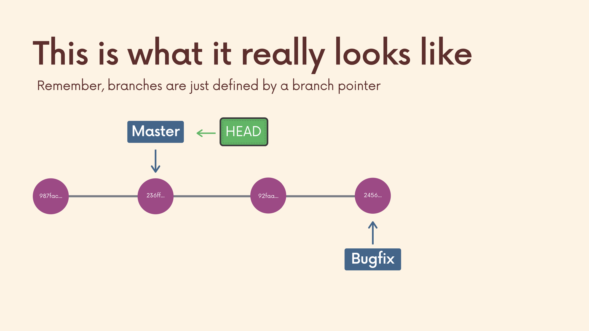

# The Git & Github Bootcamp

## Section 7. Merging Branches, Oh Boy!
---
### 7.53 What Really Matters In This Section
**Critical:** Fast Forward Merges, Git Merge & Merge Commits, Resolving Merge Conflicts
**Importatn:** 
**Nice To Have** Using VScode To Resolve Conflicts
[Section Slide: S7_Git+&+Github+Course_+Merging.pdf](doc/S7_Git+&+Github+Course_+Merging.pdf)

----

### 7.54 An Introduction To Merging

**Merging Introduction** [Merging Doc](https://git-scm.com/docs/git-merge)

**Fast Forward Merging** 

----

### 7.55 Performing A Fast Forward Merge
Use `git branch -v` to check more detail information of the branch.
Process to master sub-branch to master:
1. Use `git switch master` to switch to the branch want to merge (target branch);
2. Use `git merge sub-branch` to merge sub-branch to master branch. It will show `Fast-forward`, if this is a fast forward merge.
3. If don't need the sub-branch, remeber to use `git branch -d sub-branch` to delete the sub-branch.

----

### 7.56 Visualizing Merges
We can use the **GitKraken** to see the branch merging visualization.

----

### 7.57 Generating Merge Commits
**Not Fast Forward Merging** 

The new commit has two different parents.
When we in master branch to merge the sub-branch using `git merge sub-branch` and it's not fast forward merge, it will create a new commit with two different parents from master and sub-branch, and we need add the commit message. 

----

### 7.58 Oh No! Merge Conflicts!

----

### 7.59 Resolving Merge Conflicts
If there is conflict between two branches and we want to merge.
1. In master branch, use `git merge sub-branch`. It will report `Automatic merge failed; fix conflicts and then commit the result`;
2. Open the conflict file and modify the conflict part;
3. Use `git status` and `git diff` to check the modification;
4. Use `git add conflict_file` and `git commit -m "resolve conflicts"`;

----

### 7.60 Using VSCode To Resolve Conflicts
 VSCode has automatic choices to choose which branch you want. Look simple. It's better to process manually line by line to be safe, if there is conflict.

----

### 7.61 Merging Exercise
[Git Mergin Exercise](https://plum-poppy-0ea.notion.site/Git-Merging-Exercise-0236a17f04c847159a38f5efa978ce2c)
