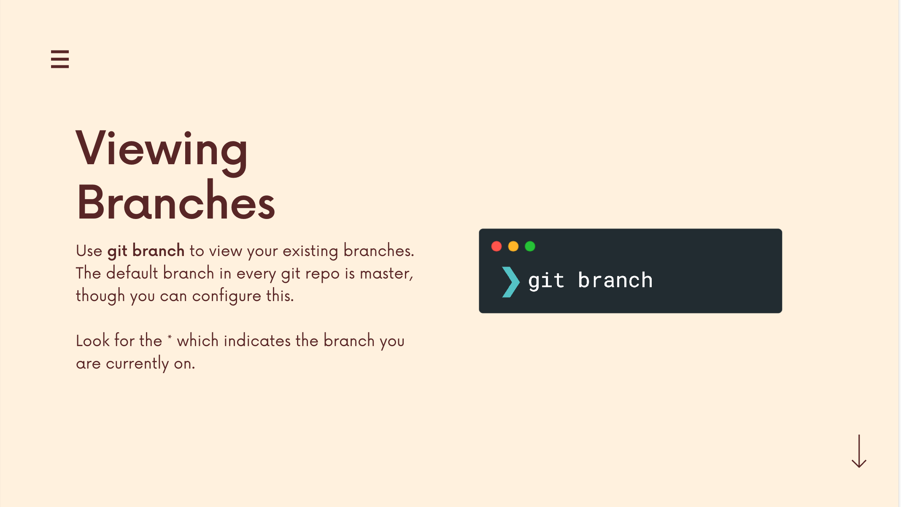
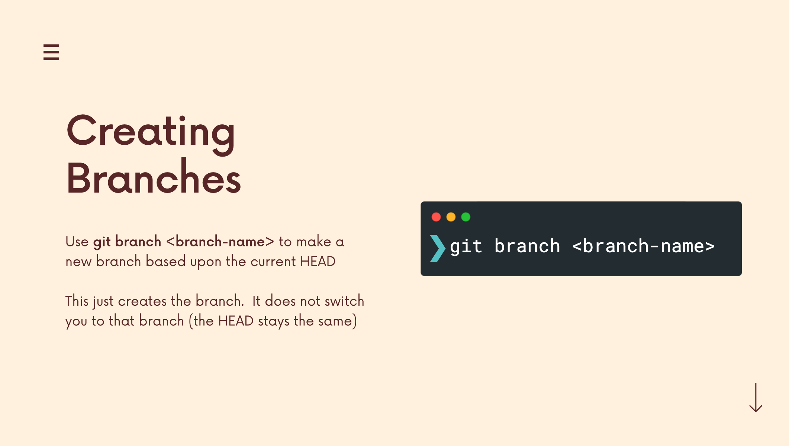

# The Git & Github Bootcamp

## Section 6. Working With Branches
---
### 6.41 What Really Matters In This Section
**Critical:** Branching? What is it? Why use it? Understanding Git HEAD, Git Branch, Git Switch, Git Checkout
**Importatn:** Deleting & Renaming Branches, Master VS. Main Branch
**Nice To Have** HEAD & Refs behind the scenes

[Section Slide: S6_Git+&+Github_+Branching.pdf](doc/S6_Git+&+Github_+Branching.pdf)

----

### 6.42 Introducing Branches

----

### 6.43 The Master Branch (Or is It Main?)

----

### 6.44 What On Earth Is HEAD?

The most recent commit to the current checkout branch is indicated by the **HEAD**. A pointer to any reference, in a sense. The “current branch” can be thought of as the HEAD. The HEAD is moved to the new branch when you use the “checkout” command to swap branches.

**HEAD** is the reference to the most recent commit in the current branch. This means HEAD is just like a pointer that keeps track of the latest commit in your current branch. However, this definition just gives us a basic overview of HEAD, so before deep diving into HEAD let us learn about two things before that is **refs** and **head**.

When you initialize your local directory to a git repository, you see that a .git folder is created. Let us now create a file demo.txt and add this file to the staging area and commit the changes. 

Now let us get into the .git/refs folder, we can see two more subdirectories being created which are heads and tags. Inside the heads folder, you can find the branch names such as master, main, etc, and in tags such as v0.2, v0.3, etc. These are all examples of refs. 

When we talk about branch names in the heads folder, a ref such as master represents the tip (latest commit ID) on that branch and this is called head. In this folder, we can find different files for different branches and each file will represent the latest commit ID of that branch. So, if any of the new commits is made this file keeps track of the latest commits.

----

### 6.45 Viewing All Branches With Git Branch
Document: [git branch](https://git-scm.com/docs/git-branch)

The branch name with __*__ before the branch name is current branch.

----

### 6.46 Creating & Switching Branches
Document: [git branch](https://git-scm.com/docs/git-branch)
Document: [git switch](https://git-scm.com/docs/git-switch)

----

### 6.47 More Practice With Branching

----

### 6.48 Another Option: Git Checkout Vs. Git Switch

----

### 6.49 Switching Branches With Unstaged Changes?

----

### 6.50 Deleting & Renaming Branches

----

### 6.51 How Git Stores HEAD & Branches

----

### 6.52 Branching Exercise

