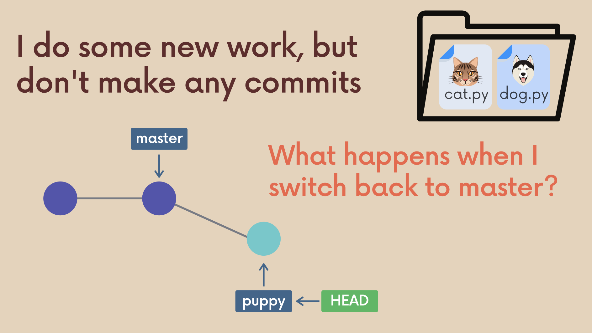
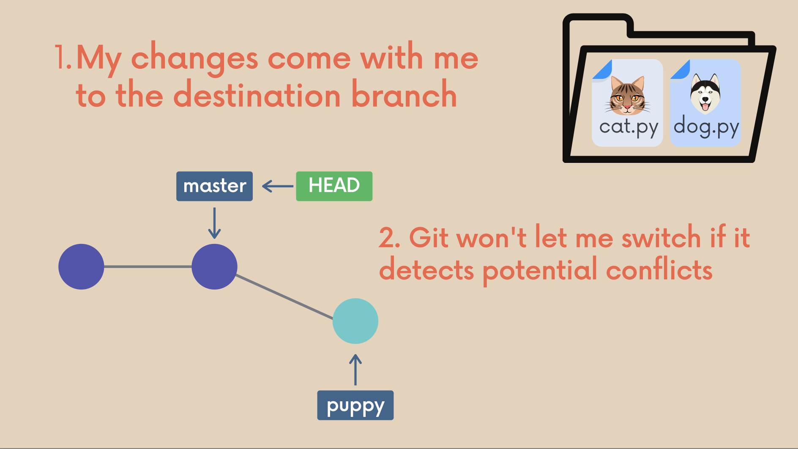
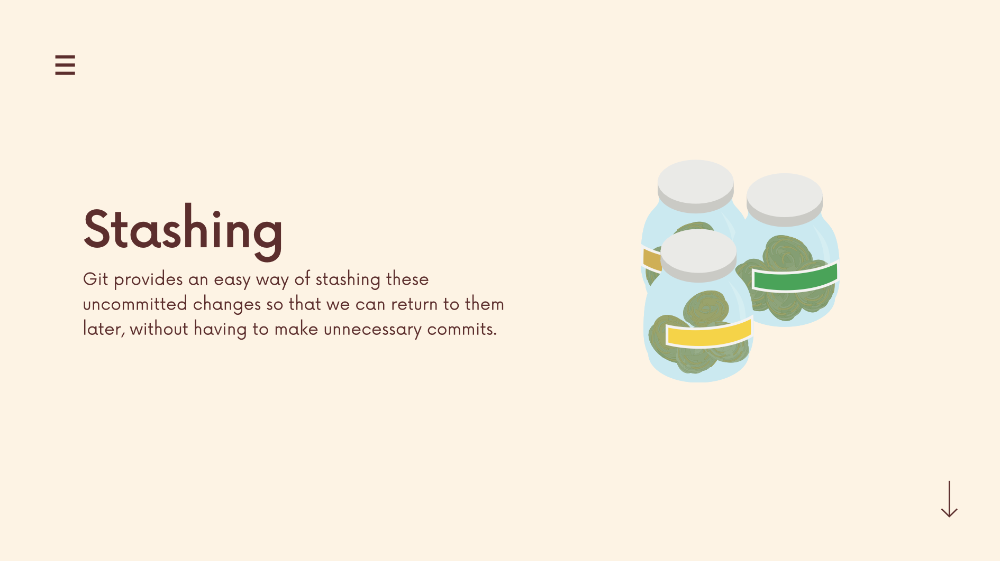
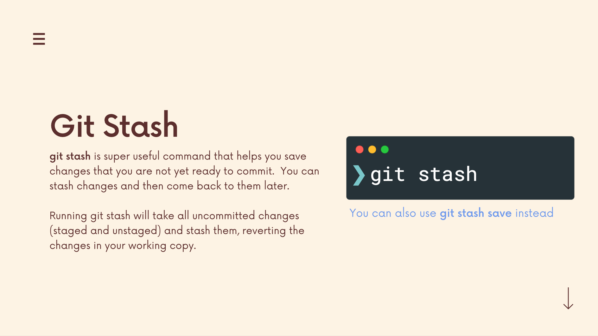
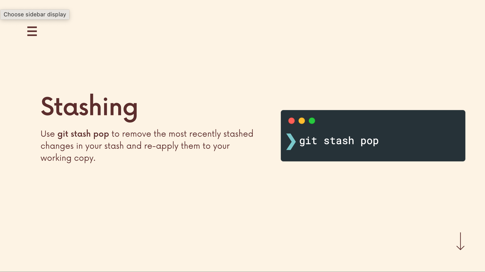
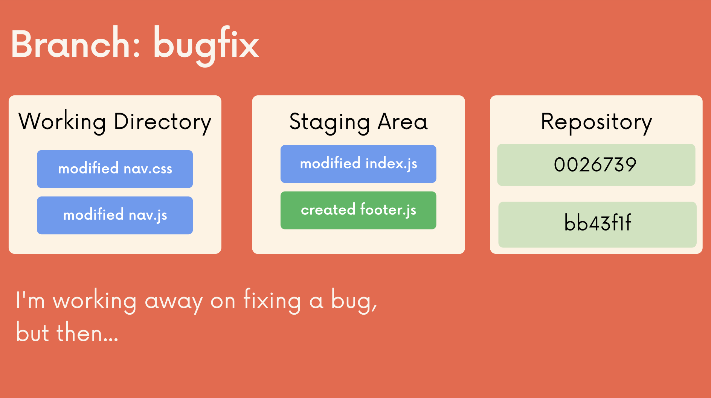
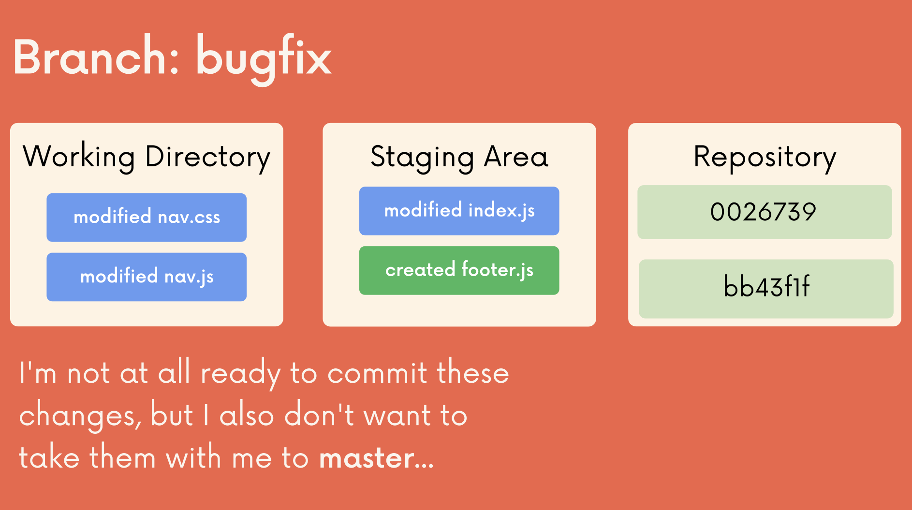
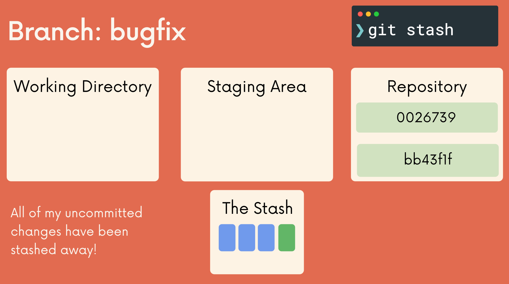
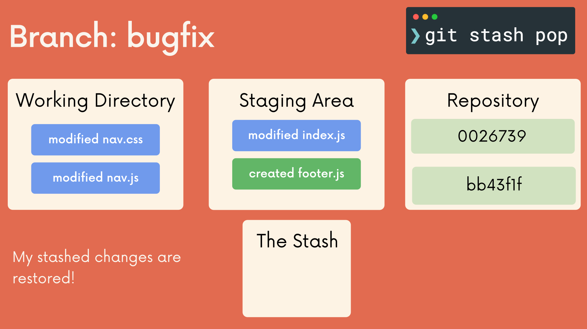

# The Git & Github Bootcamp

## Section 9. The Ins and Outs of Stashing
---
### 9.73 What Really Matters In This Section
**Critical:** 
**Importatn:** Git Stash Basics, Git Stash Save, Git Stash Pop
**Nice To Have:** Git Stash Apply, Dropping & Clearing The Stash, Working With Multiple Stashes
[Section Slide: S9_Git+&+Github_+Stashing.pdf](doc/S9_Git+&+Github_+Stashing.pdf)

----

### 9.74 Why We Need Git Stash

**Git Stash Introduction:** [git stash](https://git-scm.com/docs/git-stash)

----

### 9.75 Stashing Basics: Git Stash Save & Pop

----

